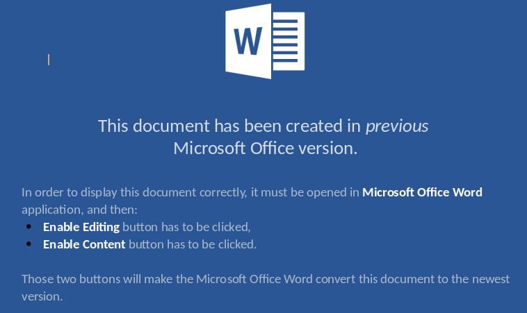

## RobustPentestMacro

This is a rich-featured Visual Basic macro code for use during Penetration Testing assignments, implementing various advanced post-exploitation techniques like sandbox evasion, WMI persistence and ~~page substitution~~. Intended to be able to infect both Windows and Mac OS X Office platforms by implementing platform-detection logic.

Created to make it possibly to simply _Paste Payload then Copy & Paste entire macro_ into phished document.

For list of example Macro generation and usage scenarios one can check out author's gist here:

[Various-Macro-Based-RCEs.md](https://gist.github.com/mgeeky/9dee0ac86c65cdd9cb5a2f64cef51991)


---

### SYNOPSIS:

This is a skeleton code for the malicious Macro that could
be used during Penetration Testing assignments (or for education
purposes), in order to embed it within Phishing documents as a
Microsoft Office macro.

There are following features implemented:

- **Platform detection logic (Windows/MacOS X)** - All the penetration tester has to do, is to generate both Windows and Mac OS X commands and put them into appropriate macro's functions: `WindowsMalware()` and `MacMalware()`
- **Sandbox detection** (Windows) - allowing to exit macro when being scanned
- **WMI Subscription persistence** (Windows) - allowing to survive system restart
- **Social Engineering trick by shape removing** - for hiding fake "Enable Content" warning.
- **Supporting both MSWORD and EXCEL startup routines**


> One should definitely feed this script into some kind of 
> Visual Basic obfuscator, like the author's one:
>	[VisualBasicObfuscator](https://github.com/mgeeky/VisualBasicObfuscator)

The macro's code has been built up from other author's building blocks:
- [WMIPersistence.vbs](https://gist.github.com/mgeeky/d00ba855d2af73fd8d7446df0f64c25a)
- [MacroDetectSandbox.vbs](https://gist.github.com/mgeeky/61e4dfe305ab719e9874ca442779a91d)


---

### CONFIGURATION

The most essential configuration here is filling up functions like `MalwareWindows()` and `MalwareMac()`.
One can for instance leverage **Empire** stager's functionality and obtain two payloads - for:
- `windows/macro`
- `osx/macro`

Then one have to put this way generated macros into aforementioned `Malware*()` functions. The penetration tester also can use buil-in primitives like:
- `ExecuteCommand(command)`
- `ExecuteCommandAndPersist command, startupTaskName`

For instance, such modifications to the script could look like:

```
Private Sub WindowsMalware()
	[...]
	str = "powershell -noP -sta -w 1 -enc  ABCDEFGHIJKLMNOPQ"
    str = str + "ABCDEFGHIJKLMNOPQRSTUWXYZ0123456789"
    ' Rest of the powershell command cut for brevity
    ' [...]
    str = str + "ABCDEFGHIJKLMNOPQRSTUWXYZ0123456789"
    
    ExecuteCommandAndPersist str, ""
End Sub

Private Sub MacMalware()  
	[...]
	cmd = "abcdefghijlmnopqrstuxwyz012345678990"
    cmd = cmd + "abcdefghijlmnopqrstuxwyz012345678990"
    ' Rest of bash command cut for brevity
    ' [...]
    cmd = cmd + "abcdefghijlmnopqrstuxwyz012345678990"
    
    Dim fullCommand As String
    fullCommand = "echo ""import sys,base64;exec(base64.b64decode(\"" " & cmd & " \""));"" | python &"

    ExecuteCommandAndPersist fullCommand, ""
```

Also, there are `Const` options documented within code's CONFIGURATION section that are self-explanatory and left to be reviewed by the user.

---

### SOCIAL ENGINEERING SHAPE REMOVAL:

In order to leverage this feature, one has to prepare a fake "_Enable Content_" warning message
like for instance Microsoft Office compatibility issues, AV scanned flag or something imaginary,
and then to create a shape consisting of TextBox (via INSERT -> Shapes... -> TextBox). Then cover
the document with this shape. Having that, one has to rename that shape using the path:
	
`(Ribbon -> HOME -> Editing -> Select... -> Selection Pane -> give it a name, like "**warning-div**")`

After that, the shape can be further modified to be floating and cover up entire document by clicking:
		
`Right click on shape -> Move selected shape -> then setting up Position and Size to 100%, Left-Top aligned.`

Among various _Social Engineering_ shapes that could be used - two of them had been attached to this repository:



---

### TODO:

- Add **OpenOffice** platform detection and autorun logic (`OnOpen`), then modify OS detection if's to support `getGUItype` method offered by OpenOffice.
- Add document layout switching functionality, like the original page subsitute function did.
- Implement host reconnaissance and situation exfil functionality
- Refactor the code to make it a bit less detectable by AVs
- Add architecture bitness detection logic and specific payload usage
- ~~Add macOS related function for platform indepency~~
- Add macOS X persistence functionality (`MacPersistence()`) in form of for instance per-user _LaunchAgents_ PLIST
- Prepare builder-script customizing script's backbone as needed by user and offering instant obfuscation
- Add more Sandbox evasion and avoidance techniques, as documented in [pafishmacro](https://github.com/joesecurity/pafishmacro/blob/master/code.vba), [here](https://securingtomorrow.mcafee.com/mcafee-labs/macro-malware-employs-advanced-obfuscation-to-avoid-detection/), [here](https://securingtomorrow.mcafee.com/mcafee-labs/macro-malware-adds-tricks-uses-maxmind-to-avoid-detection/) and [here](https://phishme.com/macro-based-anti-analysis/)

---

### KNOWN BUGS:

- The routine: `DeleteWarningShape` doesn't support Excel sheets at the moment (`ActiveWorkbook`)

---

### DISCALIMER:

The author of this code is not taking any responsibilities of
any illegal usage of it. The code had been created solely for 
Penetration Testing purposes.


---

### ☕ Show Support ☕

This and other projects are outcome of sleepless nights and **plenty of hard work**. If you like what I do and appreciate that I always give back to the community,
[Consider buying me a coffee](https://github.com/sponsors/mgeeky) _(or better a beer)_ just to say thank you! 💪 

---

## Author

```   
   Mariusz B. / mgeeky, '17
   <mb [at] binary-offensive.com>
   (https://github.com/mgeeky)
```
